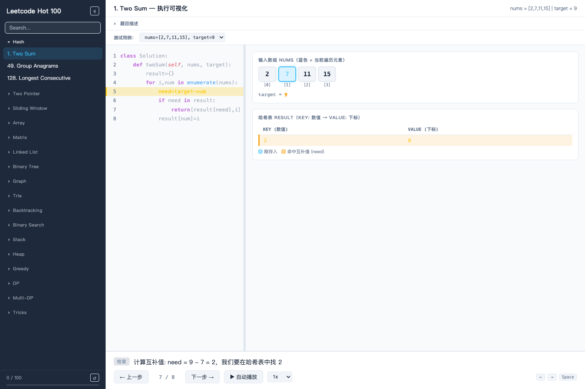
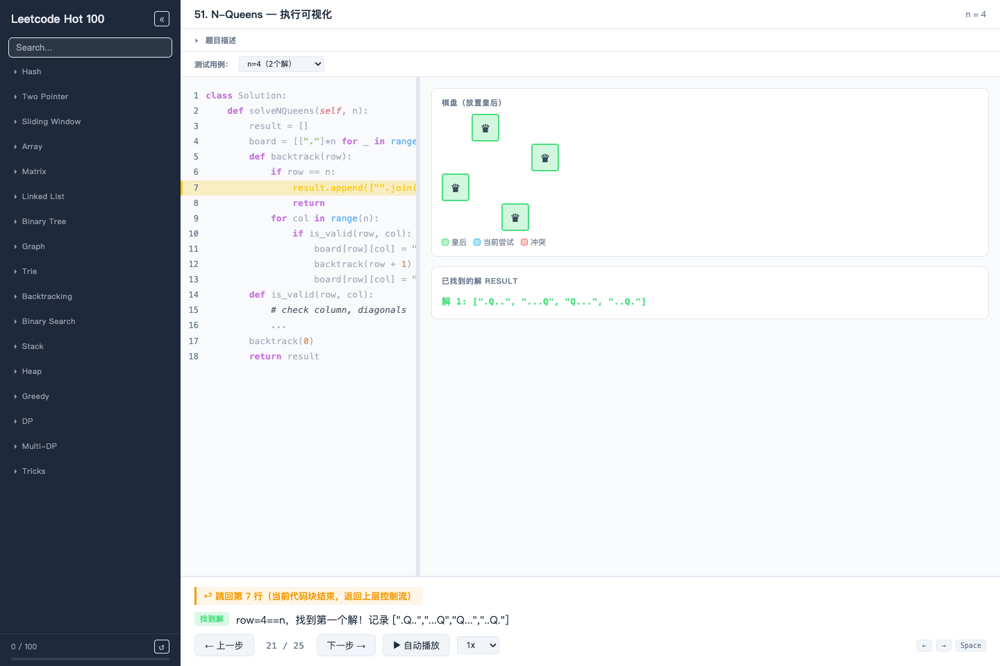
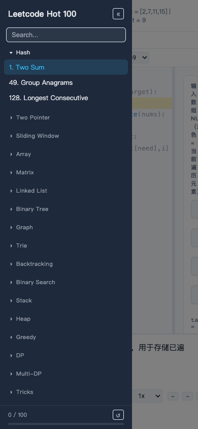

# LeetCode Hot 100 Visualization

一个面向 LeetCode Hot 100 的交互式算法执行可视化项目。通过逐行高亮 Python 代码，并同步呈现数据结构和算法状态，帮助理解每一步执行过程。

**在线体验：** https://zephyrwing-ai.github.io/Leetcode-Hot-100/



## 功能

- 收录 100 道 Hot 100 题目，按 17 个算法分类组织；题目模块通过动态 `import()` 按需加载。
- Python 代码行高亮与可视化状态同步，配合阶段标签和步骤解释展示控制流与数据变化。
- 支持多测试用例、上一步/下一步、自动播放，以及 `0.5x`、`1x`、`2x` 播放速度。
- 支持题目搜索、分类折叠、本地完成进度、Hash 路由直达题目。
- 桌面端代码与状态面板可拖动调整宽度；移动端提供响应式汉堡导航。

## 可视化场景

### N Queens 回溯与首个解



### 移动端导航



## 运行架构

```text
Hash 路由
  -> manifest 查找题目
  -> 动态加载题目模块
  -> 可视化引擎组装代码面板、状态面板和控制器
  -> 当前步骤驱动代码高亮、状态渲染与文字解释
  -> localStorage 保存完成进度
```

项目是由 Vite 构建的纯前端单页应用，不包含后端服务、API 或数据库。题目步骤与渲染逻辑均位于浏览器端，完成进度仅保存在本地 `localStorage`。

## 本地运行

需要 Node.js `20.19+` 或 `22.12+`。

安装依赖：

```bash
npm ci
```

开发：

```bash
npm run dev
```

生产构建与预览：

```bash
npm run build
npm run preview
```

## 项目结构

```text
src/
  components/       # 侧边栏等界面组件
  engine/           # 可视化引擎、代码面板与播放控制
  problems/         # 题目步骤、状态渲染与题目清单
  styles/           # 布局、控件和可视化样式
  main.js           # 应用入口与题目加载
  router.js         # Hash 路由
openspec/            # OpenSpec 配置与说明
scripts/             # 项目校验脚本
```

## OpenSpec

仓库使用 OpenSpec 管理规格化变更。提交相关变更前运行：

```bash
npm run openspec:check
```
